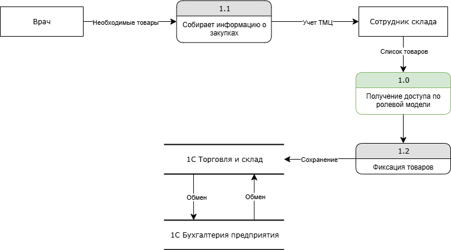

# Анализ безопасности системы

## Выявление конфиденциальных данных

Потоки данных:

1. Обращение клиента
   - **Элементы:** Пациент, Сотрудник ресепшена
   - **Хранилища:** Хранилище файлов на диске, папки: Pacients, Journals
   - **Данные**: Персональные данные клиента, журналы записей врачей

2. Осмотр клиента
   - **Элементы:** Пациент, Врач
   - **Хранилища:** Хранилище файлов на диске, папки: Laboratory Registry, Journals
   - **Данные**: Данные осмотра клиента, данные анализов клиента

3. Обработка платежей
   - **Элементы:** Пациент, Кассир
   - **Хранилища:** 1C Бухгалтерия предприятия
   - **Данные**: Данные карты

4. Управление ТМЦ
   - **Элементы:** Врач, Сотрудник склада
   - **Хранилища:** 1C Бухгалтерия предприятия, 1C Торговля и склад
   - **Данные**: Товарно-материальные ценности (ТМЦ)

**Конфиденциальные данные**: Персональные данные клиентов, протоколы обследования, данные анализов клиентов, платежные данные клиента.

## Аудит мер по обеспечению безопасности данных

1. **Отсутствие защиты конфиденциальных данных**. Excel файлы, документы клиентов и результаты анализов хранятся в незашифрованном виде.
2. **Отсутствие согласия пациентов на обработку персональных данных**. Согласно закону ФЗ-152 "О персональных данных" для сбора персональных данных необходимо согласие субъекта.
3. **Отсутствие ограничения доступа к данных**. Доступ ко всем файлам и данным не ограничен, любой пользователь имеющий доступ к системе, может просматривать и редактировать любые файлы.
4. **Отсутствие системы логирования и мониторинга**. Нет возможности отследить инциденты взлома или утечки данных, а так же восстановить утерянные или испорченные файлы. 

## Улучшения

### Список данных для защиты

1. **Персональные данные клиентов** - Шифрование, обезличивание
2. **Протоколы обследований** - Шифрование, обезличивание
3. **Данные анализов клиентов** - Шифрование, обезличивание
4. **Платежные данные** - Шифрование, обфускация

### Тегирование

1. **Персональные данные клиентов** - PII
2. **Протоколы обследований** - PHI
3. **Данные анализов клиентов** - LAB
4. **Платежные данные** - FIN

### Потоки данных

1. Обращение клиента

2. Осмотр клиента

3. Обработка платежей

4. Управление ТМЦ

