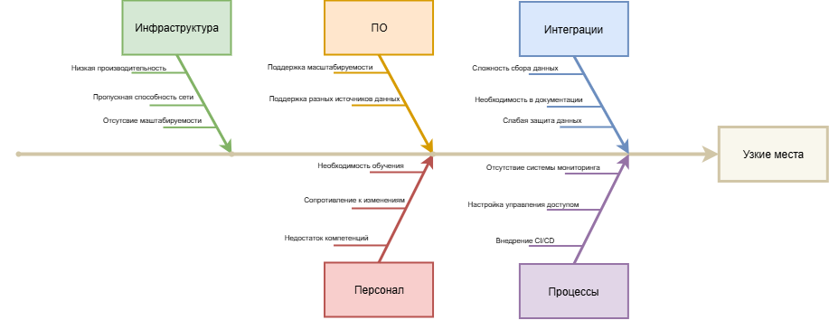

# Анализ ситуации

## Диаграмма Исикавы

## Отчет

| Категория           | Возможные проблемы | Рекомендации |
|---------------------|--------------------|--------------|
| Инфраструктура      | Низкая производительность серверов | Внедрить контейнеризацию, обеспечить отказоустойчивость и масштабируемость, настроить наблюдаемость и систему уведомлений|
| Программное обеспечение | Поддержка разных источников данных | Реализовать миграцию данных в централизованное хранилище |
| Интеграция          | Несогласованность сервисов, разграничение доступа | Внедрить RBAC |
| Персонал            | Недостаток компетенций, необходимость перехода на новое ПО | Проводить обучения |
| Процессы            | Отсутствие автоматизации и мониторинга | Настроить CI/CD, настроить мониторинг |